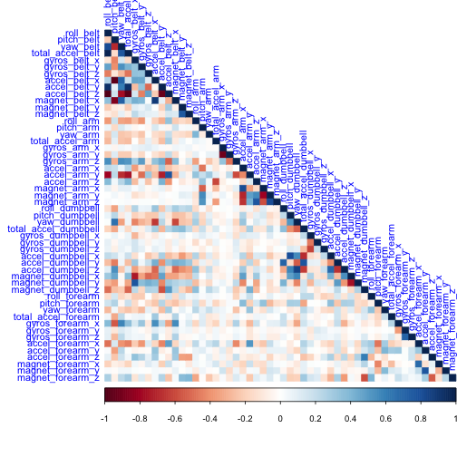
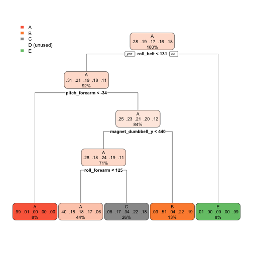

---
title: "Peer-graded Assignment: Prediction Assignment Writeup"
author: "Shovit Bhari"
date: 2020-05-25
output: html_document
---


# Human Activity Recognition

## 1. Overview

This is the final report for Coursera's Practical Machine Learning course, which is a part of Data Science Specializaiton. The main goal of the project is to predict the manner in which 6 participants performed dumbell bicep curls using different machine learning algorithms. The results and accuracy of the training model is used to predict the behavior of 20 test cases. The results of the predictions are submitted in a quiz.  

## 2. Introduction

Large amount of data about personal activity can be collected relatively inexpensively using devices such as Jawbone Up, Nike FuleBand, and Fitbit. These smart devices have helped improve people's health by finding patterns in their behaviors. People often quntify how much of a particular activity they do, but rarely quantify their quality. 

As per [Human Activity Recognition Project,](http://web.archive.org/web/20161224072740/http:/groupware.les.inf.puc-rio.br/har) Six young health participants were asked to perform one set of 10 repetitions of the Unilateral Dumbbell Biceps Curl in five different fashions and accelerometers are located in different parts. 

* Class A: Exactly according to the specification (Class A) 
* Class B: Throwing the elbows to the front
* Class C: Lifting the dumbell only halfway
* Class D: Lowering the dumbell only halfway
* Class E: Throwing the hips to the front

The location of accelerometers are depicted in the image below. 

{width=200px}

Class A corresponds to the specified execution of the exercise, while the other 4 classes correspond to common mistakes. Participants were supervised by an experienced weight lifter to make sure the execution complied to the manner they were supposed to simulate. The exercises were performed by six male participants aged between 20-28 years, with little weight lifting experience. Researchers made sure that all participants could easily simulate the mistakes in a safe and controlled manner by using a relatively light dumbbell (1.25kg). 


## 3. Environment Preparation

We first upload the R libraries that are necessary for the complete analysis.

```r
library(knitr)
library(caret)
library(ggplot2)
library(randomForest)
library(rpart)
library(rpart.plot)
library(rattle)
library(parallel)
library(doParallel)
library(corrplot)
```

## 4. Data Preparation
### 4.1. Download data

```r
if(!dir.exists("./data")){dir.create("./data")}
url1 <- "https://d396qusza40orc.cloudfront.net/predmachlearn/pml-training.csv"
url2 <- "https://d396qusza40orc.cloudfront.net/predmachlearn/pml-testing.csv"
filepath1 <- "./data/pml_training.csv"
filepath2 <- "./data/pml_testing.csv"
download.file (url1, filepath1)
download.file (url2, filepath2)
```

### 4.2. Load Data

```r
training <- read.csv("./data/pml_training.csv", na.strings = c("NA", "#DIV/0!", ""))
testing <- read.csv("./data/pml_testing.csv", na.strings= c("NA", "#DIV/0!", ""))
dim(training); dim(testing)
```

```
## [1] 19622   160
```

```
## [1]  20 160
```

### 4.3. Clean Data
Both datasets have 160 variables and have plenty of variables with NA values. We first remove those data that contains more than 95% of the observation ot be NA. We filter out those records. We remove NA values are removed and datasets with no NA's are created. In addition, we remove non-predictors which includes the index, subject anme, time and window variables.

```r
noNA <- colSums(is.na(training))/nrow(training) < 0.95
training_noNA <- training[, noNA]
testing_noNA <- testing[,noNA]
training_new <- training_noNA[,-c(1:7)]
testing_new <- testing_noNA[,-c(1:7)]
dim(training_new);dim(testing_new)
```

```
## [1] 19622    53
```

```
## [1] 20 53
```

### 4.4 Partition the training data into training and cross validation
The new training dataset is partitioned to 70% train dataset and 30% cross validation dataset. 

```r
inTrain  <- createDataPartition(training_new$classe, p=0.7, list=FALSE)
TrainSet <- training_new[inTrain, ]
CVSet  <- training_new[-inTrain, ]
dim(TrainSet)
```

```
## [1] 13737    53
```

### 4.5 A correlation among variables is analyzed modeling. 


```r
corrPlot <- cor(TrainSet[, -length(names(TrainSet))])
corrplot(corrPlot, method="color",type = "lower", 
         tl.cex = 0.9, tl.col = rgb(0, 0, 1))
```


  

The highly correlated variables are shown in dark colors in the graph above.

## 5. Prediction Model Building

Three methods will be applied to the model to make prediction and confusion matrix is used to calculate the results and the accuracy.

5.1: Decision Tree  
5.2: Generalized Boosted Model  
5.3: Random Forest  

### 5.1 ML Algorithm:Decision Tree


```r
dtmodel <-train(classe~., data=TrainSet, method="rpart")
dtpred <- predict(dtmodel, CVSet)
decisionTreeCM <- confusionMatrix(CVSet$classe, dtpred)
decisionTreeCM
```

```
## Confusion Matrix and Statistics
## 
##           Reference
## Prediction    A    B    C    D    E
##          A 1539   19  110    0    6
##          B  468  377  294    0    0
##          C  494   31  501    0    0
##          D  408  169  387    0    0
##          E  154  147  305    0  476
## 
## Overall Statistics
##                                           
##                Accuracy : 0.4916          
##                  95% CI : (0.4787, 0.5044)
##     No Information Rate : 0.5205          
##     P-Value [Acc > NIR] : 1               
##                                           
##                   Kappa : 0.3355          
##                                           
##  Mcnemar's Test P-Value : NA              
## 
## Statistics by Class:
## 
##                      Class: A Class: B Class: C Class: D Class: E
## Sensitivity            0.5024  0.50740  0.31371       NA  0.98755
## Specificity            0.9522  0.85181  0.87757   0.8362  0.88784
## Pos Pred Value         0.9194  0.33099  0.48830       NA  0.43993
## Neg Pred Value         0.6381  0.92288  0.77444       NA  0.99875
## Prevalence             0.5205  0.12625  0.27137   0.0000  0.08190
## Detection Rate         0.2615  0.06406  0.08513   0.0000  0.08088
## Detection Prevalence   0.2845  0.19354  0.17434   0.1638  0.18386
## Balanced Accuracy      0.7273  0.67961  0.59564       NA  0.93770
```

```r
rpart.plot(dtmodel$finalModel)
```



```r
dtAccuracy <- confusionMatrix(CVSet$class, dtpred)$overall['Accuracy']
dtAccuracy
```

```
##  Accuracy 
## 0.4915888
```


GBM and RF methods takes a long time to run. So parallel processing is used in caret package to increase processing time. Combination of prallel and doParallel packages are used to improve performance time. 

```r
# 1: Configure Parallel Processing
cluster <- makeCluster(detectCores() - 1) # convention to leave 1 core for OS
cluster
```

```
## socket cluster with 7 nodes on host 'localhost'
```

```r
registerDoParallel(cluster)
```


```r
#2: Configure trainControl object
fitControl <- trainControl(method = "cv",
                           number = 5,
                           allowParallel = TRUE)
```


### 5.2 ML Algorithm: Generalized Boosted Model

```r
#3: Develop Training Model
gbmmodel <-train(classe~., data=TrainSet, method="gbm", trControl=fitControl)
```


```r
gbmpred<- predict(gbmmodel, CVSet)
GBM_CM <- confusionMatrix(CVSet$classe, gbmpred)
gbmAccuracy<- confusionMatrix(CVSet$class, gbmpred)$overall['Accuracy']
GBM_CM
```

```
## Confusion Matrix and Statistics
## 
##           Reference
## Prediction    A    B    C    D    E
##          A 1645   19    5    3    2
##          B   33 1080   22    1    3
##          C    0   35  974   15    2
##          D    0    2   35  917   10
##          E    3   12    9   15 1043
## 
## Overall Statistics
##                                           
##                Accuracy : 0.9616          
##                  95% CI : (0.9564, 0.9664)
##     No Information Rate : 0.2856          
##     P-Value [Acc > NIR] : < 2.2e-16       
##                                           
##                   Kappa : 0.9514          
##                                           
##  Mcnemar's Test P-Value : 0.0001761       
## 
## Statistics by Class:
## 
##                      Class: A Class: B Class: C Class: D Class: E
## Sensitivity            0.9786   0.9408   0.9321   0.9642   0.9840
## Specificity            0.9931   0.9875   0.9893   0.9905   0.9919
## Pos Pred Value         0.9827   0.9482   0.9493   0.9512   0.9640
## Neg Pred Value         0.9915   0.9857   0.9854   0.9931   0.9965
## Prevalence             0.2856   0.1951   0.1776   0.1616   0.1801
## Detection Rate         0.2795   0.1835   0.1655   0.1558   0.1772
## Detection Prevalence   0.2845   0.1935   0.1743   0.1638   0.1839
## Balanced Accuracy      0.9858   0.9642   0.9607   0.9774   0.9879
```

```r
gbmAccuracy
```

```
##  Accuracy 
## 0.9615973
```

### 5.3 ML Algorithm:Random Forest

```r
#3: develop rf training model
rfmodel <- train(classe~., data=TrainSet, method="rf", trControl=fitControl)
```


```r
rfpred <- predict(rfmodel, CVSet)
rfCM<- confusionMatrix(CVSet$classe, rfpred)
rfCM
```

```
## Confusion Matrix and Statistics
## 
##           Reference
## Prediction    A    B    C    D    E
##          A 1673    1    0    0    0
##          B    6 1133    0    0    0
##          C    0    9 1016    1    0
##          D    0    0   20  943    1
##          E    0    0    1    3 1078
## 
## Overall Statistics
##                                           
##                Accuracy : 0.9929          
##                  95% CI : (0.9904, 0.9949)
##     No Information Rate : 0.2853          
##     P-Value [Acc > NIR] : < 2.2e-16       
##                                           
##                   Kappa : 0.991           
##                                           
##  Mcnemar's Test P-Value : NA              
## 
## Statistics by Class:
## 
##                      Class: A Class: B Class: C Class: D Class: E
## Sensitivity            0.9964   0.9913   0.9797   0.9958   0.9991
## Specificity            0.9998   0.9987   0.9979   0.9957   0.9992
## Pos Pred Value         0.9994   0.9947   0.9903   0.9782   0.9963
## Neg Pred Value         0.9986   0.9979   0.9957   0.9992   0.9998
## Prevalence             0.2853   0.1942   0.1762   0.1609   0.1833
## Detection Rate         0.2843   0.1925   0.1726   0.1602   0.1832
## Detection Prevalence   0.2845   0.1935   0.1743   0.1638   0.1839
## Balanced Accuracy      0.9981   0.9950   0.9888   0.9958   0.9991
```

```r
rfAccuracy<- confusionMatrix(CVSet$class, rfpred)$overall['Accuracy']
rfAccuracy
```

```
##  Accuracy 
## 0.9928632
```


```r
#4: de-register parallel processing cluster
stopCluster(cluster)
registerDoSEQ()
```

## 6.Applying the Selected Model to the Test Data

The accuracy of the 3 regression modeling methods above are:

* Decision Tree : 0.4915888
* GBM           : 0.9615973
* Random Forest : 0.9928632

Random Forest method has the highest accuracy of 0.9928632. Therefore, the Random Forest model will be applied to predict the testing dataset (Project Quiz results for 20 sets)


```r
predict(rfmodel, testing_new)
```

```
##  [1] B A B A A E D B A A B C B A E E A B B B
## Levels: A B C D E
```
